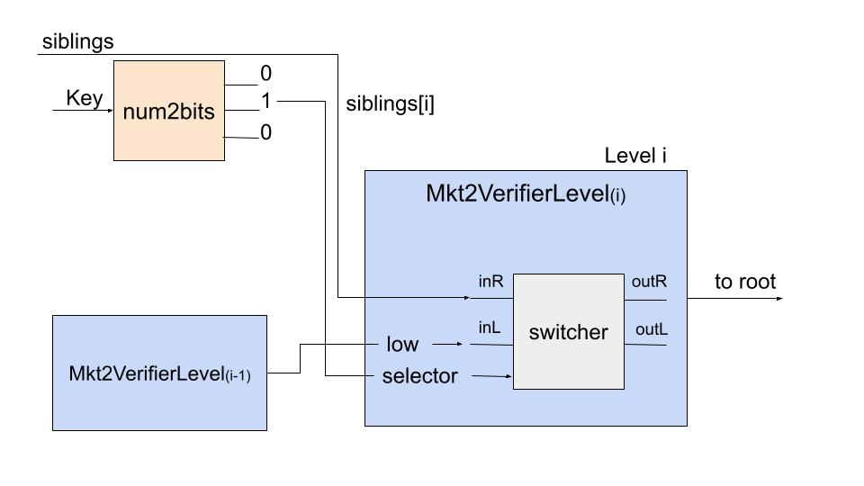

# zk-SNARK proof of Merkle tree membership using circom

This _zk-SNARK proof of Merkle tree membership using circom_ follows:

<a id="1"> [[1] Jose L. Muñoz-Tapia's circom tutorial '_Introducing Circom 2.0 by Iden3_'](https://youtu.be/6XxVeBFmIFs?t=4744)</a>

<a id="2"> [[2] Sílvia Margarit Jaile's Master Thesis '_Smart registration in Blockchain using zk-SNARKs_'](https://upcommons.upc.edu/bitstream/handle/2117/367941/SilviaMargarit_MasterThesis.pdf).</a>

This is the attempt to use zk-SNARKs to solve the following problem:

Verifiably prove a membership to the Merkle tree of public keys, without revealing any private information.

## [0] Install dependencies

```
yarn install
```

## [1] Design and create the circom circuit

The Merkle tree membership proof relies on the following circom circuit scheme, as presented in [[2]](#2):



Here is the circuit code, with the instantiation of the level 3 Merkle tree verifier. There are four inputs of the main component `Mkt2Verifier`, and the only public one is _root_:

- _key_ - the Merkle tree leaf position for the leaf we want to prove membership
- _value_ - the private key for which we want to prove Merkle tree membership for
- _root_ - the Merkle tree root
- _siblings_ - an array of siblings of the Merkle tree leaf we're interested in checking

```
pragma circom 2.0.0;

include "../../node_modules/circomlib/circuits/switcher.circom";
include "../../node_modules/circomlib/circuits/poseidon.circom";
include "../../node_modules/circomlib/circuits/bitify.circom";

template Mkt2VerifierLevel() {
    signal input sibling;
    signal input low;
    signal input selector;
    signal output root;

    component sw = Switcher();
    component hash = Poseidon(2);

    sw.sel <== selector;
    sw.L <== low;
    sw.R <== sibling;

    log(sw.outL);
    log(sw.outR);

    hash.inputs[0] <== sw.outL;
    hash.inputs[1] <== sw.outR;

    root <== hash.out;
}

template Mkt2Verifier(nLevels) {

    signal input key;
    signal input value;
    signal input root;
    signal input siblings[nLevels];

    component hashV = Poseidon(1);

    hashV.inputs[0] <== value;

    component n2b = Num2Bits(nLevels);
    component levels[nLevels];

    n2b.in <== key;

    for (var i=nLevels-1; i>=0; i--) {
        levels[i] = Mkt2VerifierLevel();
        levels[i].sibling <== siblings[i];
        levels[i].selector <== n2b.out[i];
        if (i==nLevels-1) {
            levels[i].low <== hashV.out;
        }
        else {
            levels[i].low <== levels[i+1].root;
        }
    }

    root === levels[0].root;
}

component main { public [root] } = Mkt2Verifier(3);
```

## [3] The trusted setup

_Powers of tau_ ceremony provides the so-called _trusted setup_ for the generation of proving and verification keys. This part is _not circuit specific_ and does _not_ need to be run again if the circuits are altered. Run the `setup.sh` script:

```
yarn setup
```

## [4] Generate proof and verification

By running the `proof.sh` script, we compile the circuit, generate proving and verification keys, and generate the solidity contract for on-chain proof verification. This part _is circuit specific_ and _does_ need to be run again if the circuits are altered:

```
yarn proof
```

## [5] Local testing

For the purpose of testing, a mock Merkle tree is generated by the help of the functions in the `test/utils/merkle.js` file. These functions are tested in the `test/1_test_merkle_js.js` file, and the circuit itself in the `test/2_test_merkle_circom.js`:

```
yarn hardhat test
```
